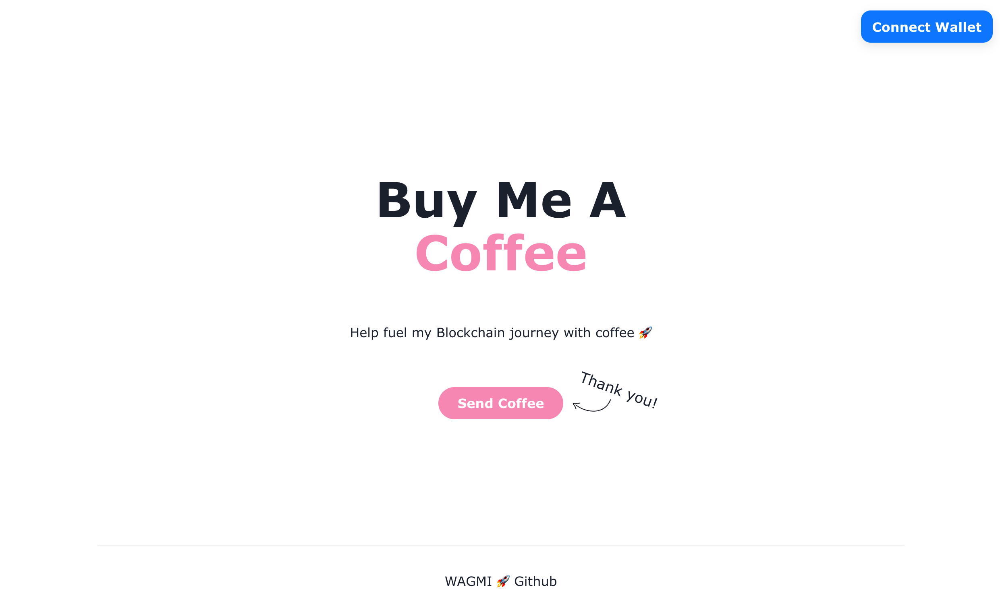
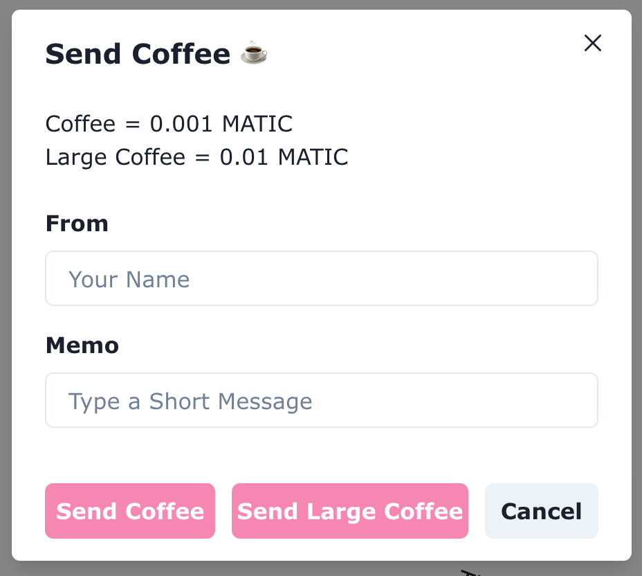
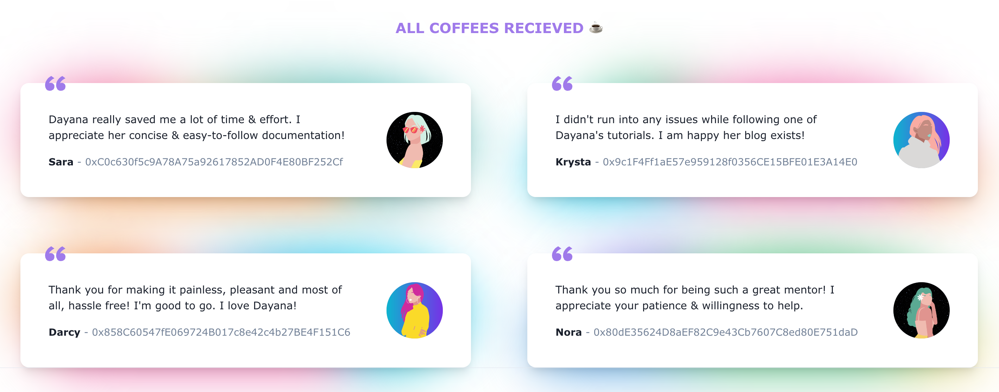

# Buy Me Coffee DApp

A DApp that let's others send me coffee with crypto! ☕️
* View verified smart contract on Mumbai: https://mumbai.polygonscan.com/address/0xD9eA50f537bDc8A5c3cFBD5dfef04Dea846212d5#code
### Road to Web3 Week 2 Challenge: Build "Buy Me a Coffee" DeFi DApp
* https://docs.alchemy.com/docs/how-to-build-buy-me-a-coffee-defi-dapp
* I followed the smart contract portion exactly as the tutorial instructed. The only difference was that I deployed to Mumbai. 
* On the front-end, I free-styled it. 

## Features ✨
Below I explain all the features I added to the front-end + what I used to build it. 
### Landing Page

* Connect Wallet using Rainbow Kit
* Created the landing page using this Chakra Template w/ some modifications: https://chakra-templates.dev/templates/page-sections/hero/callToActionWithAnnotation
### Send Coffee Modal

* Used the Chakra UI Modal & Form Components to create this "Form Modal"
  * Modal: https://chakra-ui.com/docs/components/modal/usage
  * Form: https://chakra-ui.com/docs/components/form-control/usage
* Using Chakra UI + Tailwind CSS has definately made front-end development a faster process, I recommend. 👍
* Added two options for sending coffee: Regular or Large using Chakra UI's Button Component
* Utilized wagmi React Hooks to send transactions. 
  * useContract() https://wagmi.sh/docs/hooks/useContract
    * This react hook allowed me to connect to my smart-contract & to trigger transactions. 

### All Coffees Recieved

* Used this Chakra UI template to display all my memos recieved: https://chakra-templates.dev/templates/page-sections/testimonials/gridBlurredBackdrop
* Avatar Images are stored on IPFS using Web3Storage. Checkout `packages/next-app/helpers/getRandomImage.js` to see all image URLs.